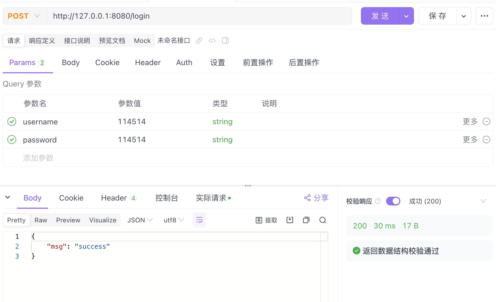

# 微服务
### 环境初始化
去项目的doc/example 打开终端
```bash
docker-compose up -d
使用docker初始化一个环境
```

---

---


**微服务请求的流程**

```
请求--通过http--->api网关---服务发现--->对应服务的客户端
---通过rpc--->对应服务的服务端---返回结果--->api网关--->返回响应
```
## 服务发现
简单来说就是存放服务的地址，api网关通过服务发现找到对应服务的地址，然后通过rpc调用服务端
## 服务注册
简单来说就是服务端将自己的地址存放在服务发现中

----
使用[kitex](https://www.cloudwego.io/zh/docs/kitex/overview/)+[hertz](https://www.cloudwego.io/zh/docs/kitex/overview/)进行微服务开发


开发流程
1. 定义好idl/xxx.thrift接口
2. 使用kitex_gen生成代码
3. 实现接口
4. 编写api层

# 快速入门
## 初始化一个项目
``` bash
go mod init example 
创建一个idl目录
```
创建后的目录结构如下
```
.
├── go.mod
└── idl/
```
## 编写一个thrift文件
[thrift快速入门](./后/thrift.md)
在idl/目录下创建一个user.thrift文件
```
.
├── go.mod
└── idl
    └── user.thrift
```

编写user.thrift文件
``` thrift
namespace go user

struct UserLoginRequests{//登录请求
    1: string username,
    2: string password,
}
struct UserLoginResponse{//登录响应
    1: string msg
}

service UserService{//用户服务
    UserLoginResponse UserLogin(1:UserLoginRequests req)
}
```

创建一个cmd目录存放user服务的文件
```
├── cmd
│   └── user
├── go.mod
└── idl
    └── user.thrift
```
在cmd/user/目录下打开终端

使用kitex_gen生成user.thrift定义的代码
```bash
❯ kitex -module example -service user ../../idl/user.thrift
```
输出
```
Adding apache/thrift@v0.13.0 to go.mod for generated code .......... Done
```

对于刚刚使用的指令
``` bash
kitex -module example -service user ../../idl/user.thrift

kitex -module [gomod的名字，也就是go mod init 接的名字] -service [服务名] [thrift文件的路径]
```

现在的目录
```
.
├── build.sh //自动生成的编译脚本
├── handler.go //需要完善的业务逻辑
├── kitex_gen //kitex生成的代码，不需要修改，目前可以不细看
│   └── user
│       ├── k-consts.go
│       ├── k-user.go
│       ├── user.go
│       └── userservice
│           ├── client.go
│           ├── invoker.go
│           ├── server.go
│           └── userservice.go
├── kitex_info.yaml //kitex生成的配置文件，不需要修改，目前可以不细看
├── main.go //程序入口
└── script
    └── bootstrap.sh
```

完善handler.go
```bash
go mod tidy #更新依赖
```

``` go
package main

import (
	"context"
	user "example/cmd/user/kitex_gen/user"
)

// UserServiceImpl implements the last service interface defined in the IDL.
type UserServiceImpl struct{}

// UserLogin implements the UserServiceImpl interface.
func (s *UserServiceImpl) UserLogin(ctx context.Context, req *user.UserLoginRequests) (resp *user.UserLoginResponse, err error) {
	// TODO: Your code here...
    //req就是先前thrift文件定义的UserLoginRequests
    //resp同理
    //里面有我们定义好的字段

	if req.Username == "114514" && req.Password == "114514" {
		resp = &user.UserLoginResponse{
			Msg: "success",
		}
		return
	}
	resp = &user.UserLoginResponse{
		Msg: "fail",
	}
	return
}
```

到这里就已经完成了业务逻辑的编写

下面要进行服务注册的编写

编写main.go文件

``` go
package main

import (
	user "example/cmd/user/kitex_gen/user/userservice"
	"log"
	"net"

	"github.com/cloudwego/kitex/pkg/rpcinfo"
	"github.com/cloudwego/kitex/server"
	etcd "github.com/kitex-contrib/registry-etcd"
)

func main() {
	//使用etcd作为注册中心
	//etcd的地址为: 127.0.0.1:2379
	r, err := etcd.NewEtcdRegistry([]string{"127.0.0.1:2379"})

	if err != nil {
		panic(err)
	}

	//使用8888端口作为user服务端口
	addr, err := net.ResolveTCPAddr("tcp", ":8888")

	if err != nil {
		panic(err)
	}

	svr := user.NewServer(
		new(UserServiceImpl),         //new UserService接口的实现
		server.WithRegistry(r),       //使用etcd(变量r)作为注册中心
		server.WithServiceAddr(addr), //使用8888端口作为user服务端口
		server.WithServerBasicInfo(&rpcinfo.EndpointBasicInfo{ //设置服务的基本信息
			ServiceName: "user-service", //服务名
		}),
	)

	err = svr.Run()

	if err != nil {
		log.Println(err.Error())
	}
}
```

编写api网关层:
前端发的请求->api层->user服务


创建如下目录
```
.
├── cmd
│   ├── api
│   │   ├── main.go
│   │   └── user
│   │       └── handler.go
```

进入api/user目录，编写handler.go

```go
package user

import (
	"context"
	"example/cmd/user/kitex_gen/user"
	"example/cmd/user/kitex_gen/user/userservice"
	"net/http"

	"github.com/cloudwego/hertz/pkg/app"
	"github.com/cloudwego/kitex/client"
	etcd "github.com/kitex-contrib/registry-etcd"
)

var userClient userservice.Client //用户服务客户端

func init() {
	r, err := etcd.NewEtcdResolver([]string{"127.0.0.1:2379"})//服务发现

	if err != nil {
		panic(err)
	}
	_userClient, err := userservice.NewClient(
		"user-service",
		client.WithResolver(r),
	)
	userClient = _userClient
}
func UserLogin(ctx context.Context, c *app.RequestContext) {
	username, _ := c.GetQuery("username") //获取请求参数
	password, _ := c.GetQuery("password") //获取请求参数

	resp, err := userClient.UserLogin(ctx, &user.UserLoginRequests{ //通过客户端调用服务端
		Username: username,
		Password: password,
	})

	if err != nil {
		c.JSON(http.StatusInternalServerError, err.Error())
	}
	c.JSON(http.StatusOK, resp)
}
```

编写api/main.go

```go
package main

import (
	"example/cmd/api/user"

	"github.com/cloudwego/hertz/pkg/app/server"
)

func main() {
	h := server.Default(
		server.WithHostPorts(":8080"), //设置网关监听的端口
	) //创建网关

	h.POST("/login", user.UserLogin)

	h.Spin() //启动网关
}
```

# 运行
1. 先运行user服务
2. 运行api服务


调试api


